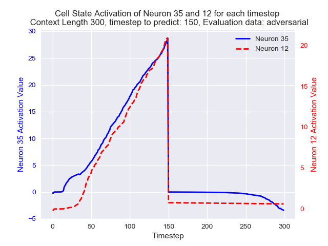

# LSTMs Exploit Linguistic Attributes of Data

[](https://travis-ci.org/nelson-liu/LSTMs-exploit-linguistic-attributes)
[](https://codecov.io/gh/nelson-liu/LSTMs-exploit-linguistic-attributes)

Code for [_LSTMs Exploit Linguistic Attributes of Data_](http://nelsonliu.me/papers/liu+levy+schwartz+tan+smith.repl4nlp2018.pdf), which will be presented at the ACL 2018 Workshop on Representation Learning for NLP.

## Table of Contents

- [Installation](#installation)
- [Getting Data](#getting-data)
- [Training a memorization model](#training-a-memorization-model)
- [Finding the indices of counting neurons in the trained memorization model](#finding-the-indices-of-counting-neurons-in-the-trained-memorization-model)
- [Visualizing the counting indices](#visualizing-the-counting-indices)
- [References](#references)


## Installation

This project is being developed in Python 3.6, but is tested
(via
[TravisCI](https://travis-ci.com/nelson-liu/LSTMs-exploit-linguistic-attributes-private))
on Python 2.7, and Python 3.6.

[Conda](https://conda.io/) will set up a virtual environment with the exact version of Python
used for development along with all the dependencies needed to run the code.

1.  [Download and install Conda](https://conda.io/docs/download.html).

2.  Change your directory to your clone of this repo.

    ```
    cd lstms_exploit
    ```

3.  Create a Conda environment with Python 3.

    ```
    conda create -n lstms_exploit python=3.6
    ```

4.  Now activate the Conda environment.  You will need to activate the Conda environment in each terminal in which you want to run code from this repo.

    ```
    source activate lstms_exploit
    ```

5.  Install the required dependencies.

    ```
    pip install -r requirements.txt
    ```

6. Visit http://pytorch.org/ and install the relevant **PyTorch 0.4** package.

You should now be able to test your installation with `py.test -v`.  Congratulations!

## Getting Data

To get the data, run:

```
./get_data.sh
```

This script should automatically download the Penn Treebank version we used.

## Training a memorization model

To reproduce the results of the paper, you'll want to start off by training a LSTM on the memorization
task with the [`./scripts/train_rnn_memorization.py`](./scripts/train_rnn_memorization.py) script.

To train on the *language* setting, use:

```
python -u scripts/train_rnn_memorization.py --run-id language_lstm_hidden_${HIDDEN}_context_${CONTEXT_LENGTH}_run1 \
    --mode language --context-length ${CONTEXT_LENGTH} --embedding-hidden-size ${HIDDEN} --cuda
```

You'll want to edit the `${CONTEXT_LENGTH}` and `${HIDDEN}` variables according to your needs. In the paper, we tested
values of `${CONTEXT_LENGTH}` between `(10, 20, 40, 60, 80, ..., 300)` and `${HIDDEN}` sizes of `50, 100, 200`. Also,
**if you aren't training on a GPU machine, remove the `--cuda` flag**.

For the rest of this short tutorial, we'll assume that you trained a model with `${HIDDEN} = 100` and 
`${CONTEXT_LENGTH} = 300`. To reiterate, we assume you ran this command and trained the model to completion:

```
python -u scripts/train_rnn_memorization.py --run-id language_lstm_hidden_100_context_300_run1 \
    --mode language --context-length 300 --embedding-hidden-size 100 --cuda
```

To train a model on any of the other datasets, simply change the value of the `--mode` flag.

## Finding the indices of counting neurons in the trained memorization model

To examine which indices in the trained LSTM are being used as counters, use the 
[`./scripts/find_counting_neurons.py`](./scripts/find_counting_neurons.py) script.

Following the model we trained above, we can run:

```
python scripts/find_counting_neurons.py --load-model models/language_lstm_hidden_100_context_300_run1/language_lstm_hidden_100_context_300_run1.th \
    --context-length 300 --cuda
```

After this script is finished running, it will print the top 10 neuron indices that are most 
correlated with timestep information. In the case above, we got (your results may be slightly different):

```
Index: 35, R2: 0.9239211462815592
Index: 12, R2: 0.9217378531664813
Index: 24, R2: 0.9192705094418173
Index: 82, R2: 0.9187911720042695
Index: 64, R2: 0.9183471004291173
Index: 79, R2: 0.9044234200522135
Index: 5, R2: 0.9001072063252709
Index: 65, R2: 0.8987763433502072
Index: 48, R2: 0.8975434982416699
Index: 16, R2: 0.8866818664302986
```

## Visualizing the counting indices

To visualize the counting indices, use the [`./scripts/visualize_neurons.py`](./scripts/visualize_neurons.py)
script. We'll take a look at neuron indices 35 and 12, since those two have the highest correlation with
the timestep information. Running the following command should save a matplotlib figure to your home directory:

```
python scripts/visualize_neurons.py --load-model models/language_lstm_hidden_100_context_300_run1/language_lstm_hidden_100_context_300_run1.th \
    --neuron-index 35 --second-neuron-index 12 --context-length 300
```

In this case, the figure generated looks like (again, your results may look different due to nondeterminism in training):



## References

```
@InProceedings{liu-levy-schwartz-tan-smith:2018:RepL4NLP,
  author    = {Liu, Nelson F.  and  Levy, Omer  and  Schwartz, Roy  and  Tan, Chenhao  and  Smith, Noah A.},
  title     = {LSTMs Exploit Linguistic Attributes of Data},
  booktitle = {Proceedings of the Third Workshop on Representation Learning for NLP},
  year      = {2018}
}
```
